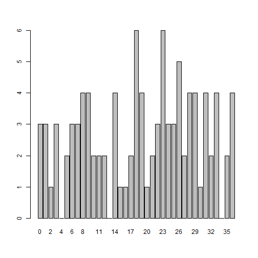

Presentation of Roulette
========================================================
author: Marc van Leeuwen
date:february 17, 2017
autosize: true

Roulette
========================================================

A simple simulation of a roulette wheel.

This program let you practice betting strategies on a roulette table

You can choose to bet on a number, Odd, Even, Black and Red.

The program shows you the Odd, Even, Black and Red statistics

and shows you a barplot with the preceding numbers


The Odd, Even, Black and Red statistics
========================================================

This calculates how often a Odd, Even, Black and Red

has been drawn (Note: 0 does'n count).

In this slide show, 100 roulettenumbers have been drawn.

The statistics are shown below.


```r
while(N<100)
{
N<-N+1
nn<<-floor(runif(1,min=0,max=37))
NumberHist[nn+1]<-NumberHist[nn+1]+1     ## Is used for the Barplot
if (nn!=0){                              ## Is used for the statistics
    if ((nn %% 2)==0){StatsHist[1,"even"]<-StatsHist[1,"even"]+1}
    if ((nn %% 2)==1){StatsHist[1,"odd"]<-StatsHist[1,"odd"]+1}
    if (RedBlack[nn]=='black'){StatsHist[1,"black"]<-StatsHist[1,"black"]+1}
    if (RedBlack[nn]=='red'){StatsHist[1,"red"]<-StatsHist[1,"red"]+1}
}
StatsHist[2,]<-StatsHist[1,]/N          ## Is used for the statuistics
}
StatsHist
```

```
    red black   odd  even
1 52.00 45.00 51.00 46.00
2  0.52  0.45  0.51  0.46
```

The Barplot
========================================================

The barplot shows you the preceding numbers.

In this slide show, 100 roulettenumbers have been drawn.

The numbers are shown below:



Betting
========================================================

It is possible to bet.

You start with 500 $

You decide the amount you want to play with

You choose Number, Odd, Even, Black, Red

After pressing the [Bet] Button, You can see how much you win or loose...
